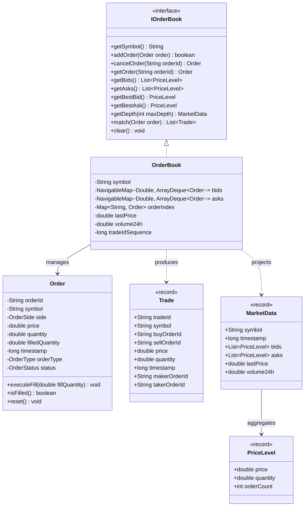

# High-Performance Order Matching Engine

An enterprise-grade, in-memory cryptocurrency order matching engine built in Java 21, designed to achieve ultra-low latency execution using LMAX Disruptor, price-time priority, and custom GC-free object pooling.

This project is built following strict **Clean Architecture**, **SOLID principles**, and **Layered Architecture** design guidelines without using heavy frameworks like Spring Boot to ensure absolute control over object allocations and CPU cache lines.

## Technical Stack
- **Language**: Java 21
- **Concurrency**: LMAX Disruptor 4.0.0
- **Serialization**: Google Protocol Buffers 3.25.1
- **Testing**: JUnit 5, Mockito
- **Build System**: Maven

---

## Clean Architecture & Design System

The system is organized into decoupled layers:

```
src/main/java/com/exchange/matching/
│
├── domain/                  # Core Business Domain (Independent of external libraries/frameworks)
│   ├── model/               # Pure Entity and Value Objects (Order, Trade, PriceLevel, etc.)
│   ├── exception/           # Domain-Specific Exceptions
│   └── repository/          # Core abstractions/interfaces for state management
│
├── application/             # Application Use Cases & Orchestrators
│   ├── engine/              # Core OrderBook and Matching Engine Orchestration
│   └── handler/             # Custom LMAX Disruptor Consumers (Risk, Matching, Journaling)
│
└── infrastructure/          # External Integrations & Low-Level Components
    ├── disruptor/           # Disruptor Setup (Ring Buffer, Event Producers)
    ├── pool/                # Garbage Collection-free Object Pools
    └── protobuf/            # Protobuf Schemas & Serialization Adaptors
```

---

## Features (Week 1 & Week 2 Roadmap)

### **Week 1: Core Domain & Data Structures**
- **GC-Free Custom Memory Management**: Pre-allocated `ObjectPool` for `Order` and `Trade` events to eliminate GC runtime overhead.
- **Price-Time Priority (FIFO)**: High-performance limit order book utilizing dual data structures for $O(1)$ and $O(\log N)$ operations.
- **Order Modification & Cancellation**: Real-time order adjustment and cancellation with strict state checking.
- **Partial/Full Order Matching**: Seamless matching mechanics generating comprehensive trade records.
- **Protobuf Schemas**: Protocol Buffers for fast, compact, and structured network payload handling.

### **Week 2: Concurrency & Async Processing**
- **LMAX Disruptor Ring Buffer**: Single-writer ring buffer architecture for high-throughput, thread-safe message passing.
- **Pipeline Processing**: 
  - `Risk Validation Handler` -> Inspects and validates account balances/limits.
  - `Matching Handler` -> Processes matching logic on the isolated single-threaded OrderBook.
  - `Journal Handler` -> Persists raw events asynchronously for recovery and replication.
- **Virtual Thread Integration**: Lightweight concurrent worker execution to keep OS overhead to a minimum.
- **Multithreaded Stress Testing**: Comprehensive validation tests targeting race conditions, data races, and performance throughput.

---

## Build and Compilation

Verify the environment compilation and run tests:

```bash
mvn clean compile
```

To run unit tests:

```bash
mvn test
```

---

## Day 1 Architecture Summary

The Day 1 codebase lays the foundation of a high-performance, low-latency cryptocurrency matching engine. It implements the innermost layer of Clean Architecture (Domain and Infrastructure core), completely decoupled from any external application framework.

### 1. Domain Model: Responsibilities & Relationships
- **[Order](file:///c:/Users/Raval%20Darshan/OneDrive/Desktop/internship-project-2/src/main/java/com/exchange/matching/domain/model/Order.java)**: Represents a client's buy/sell instruction (Limit or Market). It is a stateful entity containing properties like side, price, quantity, executed quantity, and status. It exposes a `reset()` method to clear its state for zero-GC object pool recycling.
- **[Trade](file:///c:/Users/Raval%20Darshan/OneDrive/Desktop/internship-project-2/src/main/java/com/exchange/matching/domain/model/Trade.java)**: A read-only `record` capturing executed matches. It relates a taker order against a resting maker order, tracking the executed quantity, price, execution timestamp, and respective order identifiers.
- **[PriceLevel](file:///c:/Users/Raval%20Darshan/OneDrive/Desktop/internship-project-2/src/main/java/com/exchange/matching/domain/model/PriceLevel.java)**: A read-only projection `record` showing aggregated liquidity depth (total quantity and order count) resting at a specific price point.
- **[MarketData](file:///c:/Users/Raval%20Darshan/OneDrive/Desktop/internship-project-2/src/main/java/com/exchange/matching/domain/model/MarketData.java)**: Represents the snapshot of the order book up to a specific depth (list of bid/ask `PriceLevel`s), the last trade price, and rolling 24-hour volume.
- **[IOrderBook](file:///c:/Users/Raval%20Darshan/OneDrive/Desktop/internship-project-2/src/main/java/com/exchange/matching/domain/model/IOrderBook.java)**: The contract for order book operations, defining methods for order matching, addition, cancellations, snapshots, and statistical tracking.
- **[OrderBook](file:///c:/Users/Raval%20Darshan/OneDrive/Desktop/internship-project-2/src/main/java/com/exchange/matching/domain/model/OrderBook.java)**: The core stateful implementation of `IOrderBook`. It manages the active order queues and matches them against incoming orders.



### 2. Price-Time Priority (FIFO) Matching Implementation
`OrderBook` implements price-time priority matching using dual data structures:
- **Bids and Asks Queues**: Bids are stored in a `TreeMap` sorted in descending price order (`Collections.reverseOrder()`). Asks are sorted in ascending price order.
- **Time Priority Queue**: For each price point, a FIFO queue (`ArrayDeque<Order>`) maintains orders. When an order is added, it is appended to the tail of the queue (`offer`). During matching, order execution always begins from the head of the queue (`peek`/`poll`).
- **Matching Mechanics**: Incoming taker orders are matched against opposing maker queues starting at the best available price.
  - For **LIMIT** orders, matching continues while the order has remaining quantity and the incoming price crosses the opposing price (buy price $\ge$ ask price, or sell price $\le$ bid price). Unfilled quantity is rested in the book.
  - For **MARKET** orders, matching continues at the best available prices until the order is fully filled or opposing liquidity is exhausted. Any remaining unfilled quantity is cancelled immediately.

### 3. Object Pooling (GC-Free Memory Management)
To prevent Garbage Collection latency spikes under high load, the engine implements custom object pooling in the infrastructure layer:
- **[ObjectPool&lt;T&gt;](file:///c:/Users/Raval%20Darshan/OneDrive/Desktop/internship-project-2/src/main/java/com/exchange/matching/infrastructure/pool/ObjectPool.java)**: A generic pre-allocated circular buffer (using `ArrayDeque`) that manages object instances.
- **[OrderPool](file:///c:/Users/Raval%20Darshan/OneDrive/Desktop/internship-project-2/src/main/java/com/exchange/matching/infrastructure/pool/OrderPool.java)**: A specialized pool managing `Order` entities (defaults to 10k pre-allocated, max 100k).
  - **Borrowing (`borrowOrder`)**: Pulls a pre-allocated order from the pool. If empty, it allocates a new one.
  - **Recycling (`returnOrder`)**: Resets all fields of the order (references nulled, numbers set to `0.0`/`0L`, status to `NEW`) and returns it to the pool queue.

### 4. Performance Considerations
- **$O(1)$ Order Lookup & Cancellations**: An internal hash map `orderIndex` maps `orderId` to `Order` objects, allowing instant lookup and deletion.
- **No Concurrency Locks**: `OrderBook` is deliberately non-thread-safe. In the final architecture (Day 2), thread safety is achieved through thread confinement, where a single LMAX Disruptor thread sequentially processes all modifications to the order book.
- **Zero Object Allocation (Zero-GC)**: Borrowing pre-existing orders from the pool prevents JVM garbage collector heap allocation overhead during order ingestion.
- **Lightweight Projections**: `PriceLevel` and `Trade` are implemented as Java `record`s to ensure light, read-only stack allocation where possible.

### 5. Protobuf Schemas & Domain Mapping
The system leverages Google Protocol Buffers for high-efficiency network serialization. The mapping between serialization messages and core domain objects is handled by the thread-safe **[ProtobufMapper](file:///c:/Users/Raval%20Darshan/OneDrive/Desktop/internship-project-2/src/main/java/com/exchange/matching/infrastructure/protobuf/ProtobufMapper.java)** utility class.

- **[order.proto](file:///c:/Users/Raval%20Darshan/OneDrive/Desktop/internship-project-2/src/main/proto/order.proto)**: Defines `OrderProto`, `OrderSideProto`, `OrderTypeProto`, and `OrderStatusProto`.
  - Maps to/from domain `Order`, `OrderSide`, `OrderType`, and `OrderStatus`.
- **[trade.proto](file:///c:/Users/Raval%20Darshan/OneDrive/Desktop/internship-project-2/src/main/proto/trade.proto)**: Defines `TradeProto`.
  - Maps to/from domain `Trade` record.
- **[market_data.proto](file:///c:/Users/Raval%20Darshan/OneDrive/Desktop/internship-project-2/src/main/proto/market_data.proto)**: Defines `MarketDataProto` and `PriceLevelProto`.
  - Maps to/from domain `MarketData` and `PriceLevel` records.

---

## Public Interfaces Documentation

### `IOrderBook`
The main interface specifying how to interact with the order book.
```java
public interface IOrderBook {
    String getSymbol();
    boolean addOrder(Order order);
    Order cancelOrder(String orderId);
    Order getOrder(String orderId);
    List<PriceLevel> getBids();
    List<PriceLevel> getAsks();
    PriceLevel getBestBid();
    PriceLevel getBestAsk();
    MarketData getDepth(int maxDepth);
    int getBidOrderCount();
    int getAskOrderCount();
    void clear();
    List<Trade> match(Order order);
}
```

- **`match(Order order)`**: Matches an incoming taker order against resting liquidity. Returns a list of executed trades. Remaining limit quantities are rested; unfilled market quantities are cancelled.
- **`addOrder(Order order)`**: Manually registers a resting order into the book without triggering matching checks.
- **`cancelOrder(String orderId)`**: Removes an order from the book, updates its status to `CANCELLED`, and returns the order.
- **`getDepth(int maxDepth)`**: Generates an aggregated market depth snapshot containing bids, asks, last traded price, and volume.

---

## Day 2 Continuation Guide

For developers continuing on Day 2:
1. **LMAX Disruptor Pipeline Integration**: Wrap the single-threaded `OrderBook` execution inside the LMAX Disruptor thread-safe ring buffer handler to enable ultra-low-latency asynchronous execution.
2. **Journaling & Durability**: Setup the journaling handler to serialize incoming commands to disk.
3. **Multithreaded Architecture Model**: Maintain the lock-free single-writer principle. Do not introduce synchronization inside `OrderBook`; route all writes through the Disruptor Ring Buffer.

